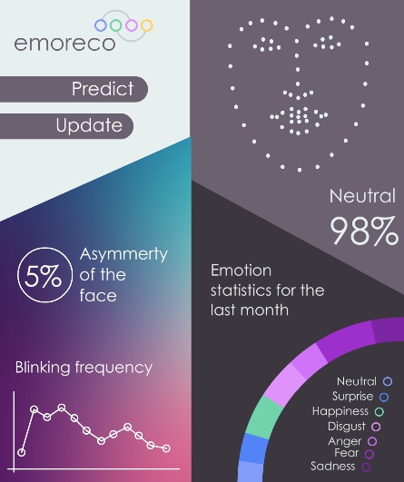

# EmoReco
### Spring - Summer 2018

It is a source code of our team project which won first prize in the National Computer Science Conference and second prize in the BelSEF. This project was represented by Belarus at the EUCYS in Dublin, Ireland. 

The program recognises your facial features and emotions by webcam. It collects your emotional statistics every month and send it to our server. The project uses Python, Tensorflow and PyQT. There are implementations of the random forest for facial alignment and a neural network for emotion recognition.

